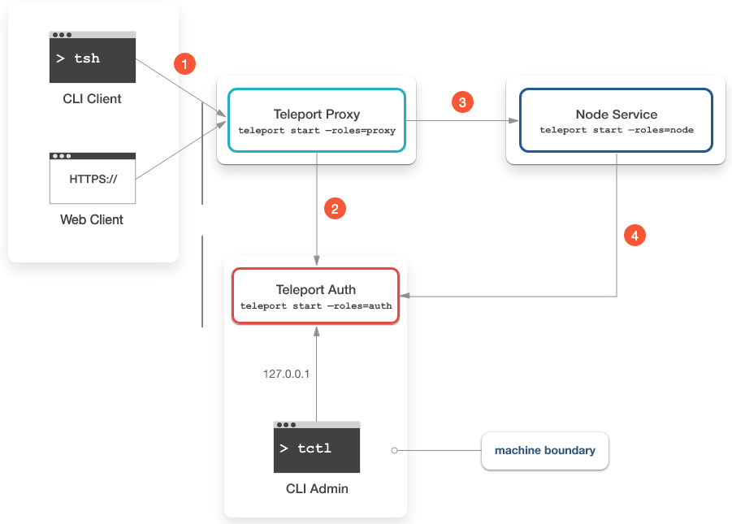

## Basic architecture
The key concept of Teleport architecture is a “cluster”. A Teleport cluster is a collection of resources such as servers, remote devices, databases, Kubernetes clusters or internal web apps.

Clients must authenticate with Teleport and receive a client certificate which automatically works for all resources in a cluster, i.e. after authentication ssh, kubectl, psql, mysql and other remote access commands will be configured with user’s identity.

To create a minimal Teleport cluster, you must launch three services:

- **Teleport Auth Service.** The certificate authority of the cluster. It issues certificates to clients and maintains the audit log.
- **Teleport Proxy Service.** The proxy allows access to cluster resources from the outside. Typically it is the only service available from the public network.
- **Teleport Node.** A Teleport node is like “sshd on steroids”. The node service runs near a target resource and speaks its native protocol such as SSH, Kubernetes API, HTTPS, PostgreSQL or MySQL wire protocols. Think a “smart sidecar” which routes user requests from a proxy to its target resource.

Let's start Teleport using `docker run`:
`docker run -d --hostname localhost --name teleport -v ~/teleport/config:/etc/teleport -v ~/teleport/data:/var/lib/teleport -p 3023:3023 -p 3025:3025 -p 3080:3080 quay.io/gravitational/teleport:7`{{execute}}.

When you execute above command, following services are initialized:
- **3023**: Teleport Proxy service that forwards incoming client SSH connection to port `3022` on the destination node.
- **3025**: Teleport Auth service serve Teleport API to other nodes in a cluster.
- **3080**: Teleport Proxy service that listens for HTTPS connection to authenticate `tsh` users and web users into the cluster. The same connection is used to serve a Web UI.