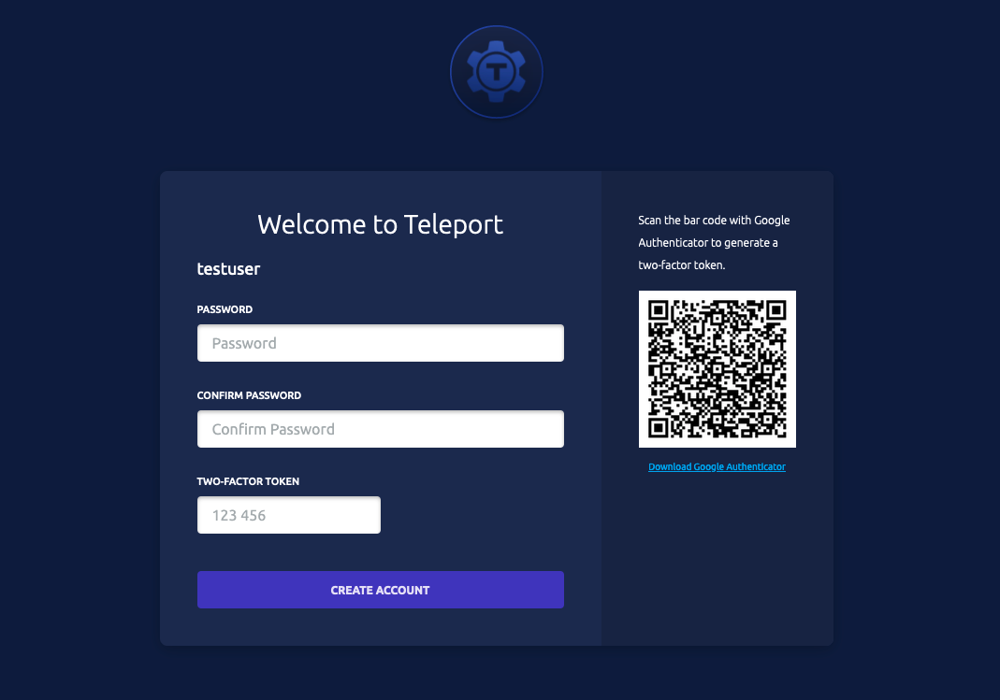
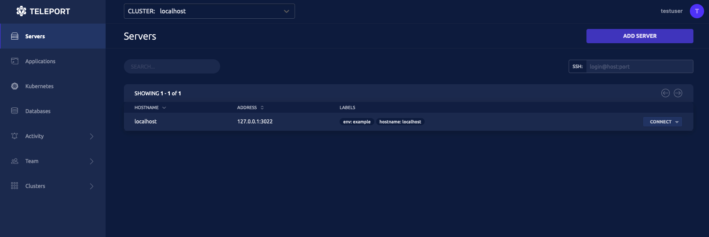

In previous step, we created a simple Teleport cluster with Proxy and Auth service. Now let's create a Teleport user that can authenticate with Teleport cluster.

### tctl
`tctl` is an administrative tool that can configure Teleport Auth Service. We use `tctl` to crete users in Teleport or create nodes that connects to Teleport cluster.

This following command will create a Teleport user(using `tctl`) called "testuser "which is allowed to log in as either operating system user root or ubuntu:
`docker exec teleport tctl users add testuser --roles=editor,access --logins=root,ubuntu,ec2-user`{{execute}}.

## Teleport Web UI

Access Teleport Web UI to complete user registration:

Format - https://[[HOST_SUBDOMAIN]]-3080-[[KATACODA_HOST]].environments.katacoda.com/web/invite/{token}>

(replace {token} with invite token value printed in terminal)

When you visit the URL, you will need to setup your account by supplying a secure password and enrolling your 2FA device. 

### UI
Once you setup your account, you will be redirected to Teleport Web UI
